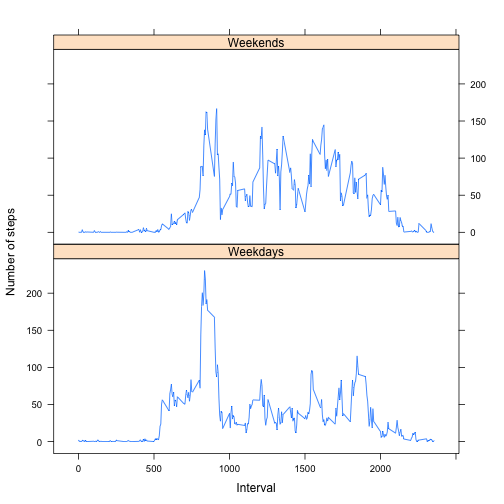

### Peer Assessment 1
by dsgrt

## Loading The Activity Data
Within my R directory, I have created a sub-folder named "represpeer1", and have downloaded the dataset to this directory and unzipped it.

To load the data into R, we read the data from the CSV file

```r
data <- read.csv("activity.csv")
```

Show summary of data

```r
summary(data)
```

```
##      steps                date          interval     
##  Min.   :  0.00   2012-10-01:  288   Min.   :   0.0  
##  1st Qu.:  0.00   2012-10-02:  288   1st Qu.: 588.8  
##  Median :  0.00   2012-10-03:  288   Median :1177.5  
##  Mean   : 37.38   2012-10-04:  288   Mean   :1177.5  
##  3rd Qu.: 12.00   2012-10-05:  288   3rd Qu.:1766.2  
##  Max.   :806.00   2012-10-06:  288   Max.   :2355.0  
##  NA's   :2304     (Other)   :15840
```

Show structure of data

```r
str(data)
```

```
## 'data.frame':	17568 obs. of  3 variables:
##  $ steps   : int  NA NA NA NA NA NA NA NA NA NA ...
##  $ date    : Factor w/ 61 levels "2012-10-01","2012-10-02",..: 1 1 1 1 1 1 1 1 1 1 ...
##  $ interval: int  0 5 10 15 20 25 30 35 40 45 ...
```

## Mean total number of steps taken per day

Load data.table package

```r
library(data.table)
```

```
## data.table 1.9.4  For help type: ?data.table
## *** NB: by=.EACHI is now explicit. See README to restore previous behaviour.
```

Sum steps by date, skipping any "NA" values

```r
datatab <- data.table(data)
sumsteps <- datatab[,sum(steps, na.rm = TRUE), by = date]
```

Create a histogram

```r
hist(sumsteps$V1, breaks = 10, main = "Steps Taken Each Day", xlab = "Total Steps")
```

 

Find mean steps per day

```r
mean(sumsteps$V1, na.rm = TRUE)
```

```
## [1] 9354.23
```

Find median steps per day

```r
median(sumsteps$V1, na.rm = TRUE)
```

```
## [1] 10395
```

## Average Daily Activity Pattern

Average steps across all days by interval

```r
meanint <- datatab[,mean(steps, na.rm = TRUE), by = interval]
```

Create a time series plot of average steps data across intervals

```r
plot(meanint$interval, meanint$V1, type = "l", main = "Average steps per interval", xlab = "Interval", ylab = "Average Steps")
```

 

Find interval with maximum amount of steps

```r
meanint[order(-V1)][1]
```

```
##    interval       V1
## 1:      835 206.1698
```

## Imputing Missing Values

Find number of NA values in steps

```r
sum(is.na(data$steps))
```

```
## [1] 2304
```

Create a copy of datatab

```r
datatab1 <- copy(datatab)
```

Join interval averages by interval number

```r
library(plyr)
library(dplyr)
```

```
## 
## Attaching package: 'dplyr'
## 
## The following objects are masked from 'package:plyr':
## 
##     arrange, count, desc, failwith, id, mutate, rename, summarise,
##     summarize
## 
## The following objects are masked from 'package:data.table':
## 
##     between, last
## 
## The following object is masked from 'package:stats':
## 
##     filter
## 
## The following objects are masked from 'package:base':
## 
##     intersect, setdiff, setequal, union
```

```r
datatab1 <- join(datatab1, meanint, by = "interval")
```

Replace NA values with interval averages

```r
for (i in 1:nrow(datatab1)) {
   if(is.na(datatab1$steps[i])) {
      datatab1$steps[i] <- datatab1$V1[i]
   }
}
```

Check that there are no NA values

```r
sum(is.na(datatab1$steps))
```

```
## [1] 0
```

Check the first couple values of datatab1

```r
head(datatab1)
```

```
##        steps       date interval        V1
## 1: 1.7169811 2012-10-01        0 1.7169811
## 2: 0.3396226 2012-10-01        5 0.3396226
## 3: 0.1320755 2012-10-01       10 0.1320755
## 4: 0.1509434 2012-10-01       15 0.1509434
## 5: 0.0754717 2012-10-01       20 0.0754717
## 6: 2.0943396 2012-10-01       25 2.0943396
```

Convert datatab1 to a data table

```r
datatab1 <- data.table(datatab1)
```

Sum steps by date, skipping any "NA" values

```r
sumsteps1 <- datatab1[,sum(steps, na.rm = TRUE), by = date]
```

Create a histogram

```r
hist(sumsteps1$V1, breaks = 10, main = "Steps Taken Each Day", xlab = "Total Steps")
```

 

Find mean steps per day

```r
mean(sumsteps1$V1, na.rm = TRUE)
```

```
## [1] 10766.19
```

Find median steps per day

```r
median(sumsteps1$V1, na.rm = TRUE)
```

```
## [1] 10766.19
```

## Differences in Activity Patterns Between Weekends and Weekdays

Convert "date" columns to class:date

```r
datatab1$date <- as.Date(datatab1$date)
```

Add weekdays to data tables

```r
datatab1$weekday <- weekdays(datatab1$date)
```

Set weekend days

```r
weekend <- c("Saturday", "Sunday")
```

Determine if day is a weekday or weekend

```r
datatab1$daytype <- datatab1$weekday %in% weekend
```

Average steps across all days by interval

```r
meanint1 <- group_by(datatab1, interval, daytype)
meanint1 <- meanint1 %>% summarise_each(funs(mean), steps)
```

Create a time series plot of average steps data across intervals

```r
library(lattice)
xyplot(steps ~ interval|daytype,
   data = meanint1,
   type = "l",
   xlab = "Interval",
   ylab = "Number of steps",
   layout = c(1,2),
   strip = strip.custom(factor.levels=c("Weekdays", "Weekends"))
   )
```

 

Thanks for looking at my assignment submission!
